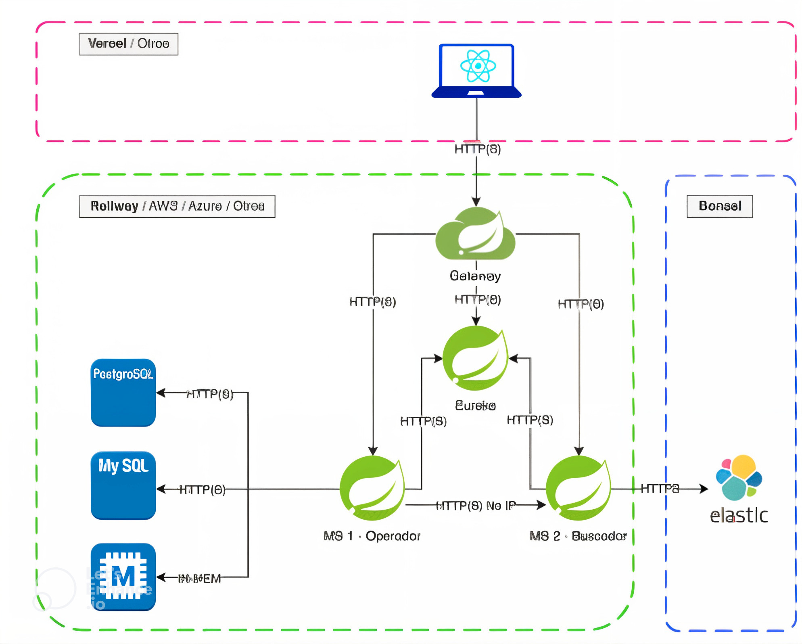
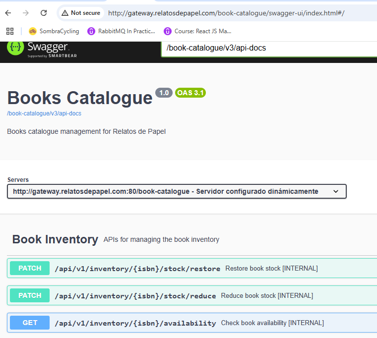
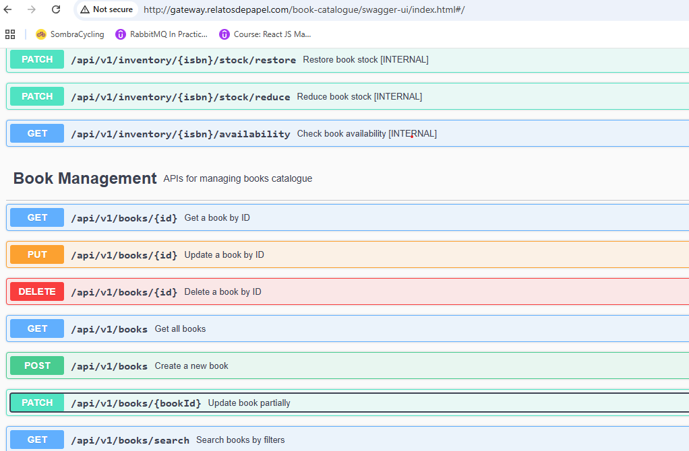

# **ms-books-catalogue**

## **Descripción General**
El microservicio **ms-books-catalogue** es el núcleo de la gestión del catálogo de libros y el inventario de nuestra aplicación **Relatos de Papel**. Este microservicio expone una API RESTful que permite:

- **Gestión de Libros**: Crear, modificar (total o parcialmente), eliminar y consultar libros.
- **Gestión de Inventario**: Controlar el stock, la disponibilidad y el estado de los libros en el inventario.
- **Búsquedas Avanzadas**: Realizar consultas combinadas utilizando múltiples filtros, como título, autor, género, editorial y rango de fechas de publicación.
- **Health Check**: Monitorear el estado del microservicio mediante un endpoint dedicado.

Este microservicio está diseñado para ser escalable y eficiente, garantizando la integridad y disponibilidad de los datos en todo momento. Además, está estructurado en dos controladores principales: **Books** e **inventory**, lo que permite una clara separación de responsabilidades y facilita el mantenimiento y la expansión del sistema.
el proyecto esta diseñado bajos  los principios **REST** y utiliza **HATEOAS** (Hypermedia as the Engine of Application State) para proporcionar respuestas enriquecidas con enlaces que permiten navegar fácilmente entre los recursos


El microservicio **ms-book-catalogue** forma parte de la siguiente arquitectura:



Este servicio expone los endpoints relacionados con el catálogo de libros a través de un [**API Gateway**](https://github.com/Angelica-Quevedo-unir/ms-springcloud-gateway). Los endpoints son registrados automáticamente en [**Eureka Server**](https://github.com/Angelica-Quevedo-unir/ms-eureka-server) , lo que permite la detección dinámica de servicios.
Además, los servicios internos encargados de la gestión de inventario son consumidos de forma interna y directa por el componente de [**ms-books-payments**](https://github.com/Angelica-Quevedo-unir/ms-books-payment), garantizando la validación del stock disponible antes de procesar un pago.


## **Estructura del Proyecto**
El proyecto sigue una arquitectura basada en capas para garantizar la separación de responsabilidades. A continuación, se detalla la estructura del proyecto:

ms-books-catalogue
```
📁 src
├── 📁 main
│   ├── 📁 java
│   │   └── 📁 es.unir.relatosdepapel.books
│   │       ├── 📁 controller       # Controladores REST o de API
│   │       ├── 📁 model            # Entidades JPA o modelos de datos
│   │       ├── 📁 repository       # Repositorios JPA o interfaces de acceso a datos
│   │       ├── 📁 service          # Lógica de negocio y servicios
│   │       ├── 📁 hateoas          # Configuración y ensambladores HATEOAS
│   │       ├── 📁 dto              # Objetos de transferencia de datos
│   │       ├── 📁 config           # Configuración de la aplicación (Beans, seguridad, etc.)
│   │       └── 📁 exception        # Manejo de excepciones personalizadas
│   └── 📁 resources
│       └── 📄 application.properties  # Configuración de la aplicación
├── 📁 test
│   ├── 📁 java                     # Clases de pruebas unitarias y de integración
│   └── 📁 resources                # Archivos de configuración de prueba
```

## **Controladores Principales**
### **1. Controlador de Libros**
Este controlador gestiona toda la información relacionada con los libros, incluyendo títulos, autores, editoriales, géneros y fechas de publicación. Los endpoints principales son:

- **POST /api/v1/books**: Crea un nuevo libro en el catálogo.
- **GET /api/v1/books**: Obtiene una lista de todos los libros disponibles con paginación.
- **GET /api/v1/books/{id}**: Obtiene los detalles de un libro específico por su ID.
- **PUT /api/v1/books/{id}**: Actualiza todos los campos de un libro existente.
- **PATCH /api/v1/books/{id}**: Actualiza parcialmente los campos de un libro existente.
- **DELETE /api/v1/books/{id}**: Elimina un libro del catálogo.
- **GET /api/v1/books/isbn/{isbn}**: Obtiene un libro por su ISBN.
- **GET /api/v1/books/search**: Realiza búsquedas avanzadas utilizando filtros combinados.

### **2. Controlador de Inventario**
Este controlador es responsable de gestionar el stock y la disponibilidad de los libros. Los endpoints principales proporcionan operaciones internas, accesibles de forma interna por el microservicio **ms-books-payments**, permitiendo validar la lógica de inventario antes de procesar un pago. Estos endpoints **no son accesibles externamente** a través del **API Gateway**.

- **GET /api/v1/inventory/{isbn}/availability**: Verifica la disponibilidad de un libro en el inventario.
- **PATCH /api/v1/inventory/{isbn}/stock/reduce**: Reduce el stock de un libro después de una compra confirmada.
- **PATCH /api/v1/inventory/{isbn}/stock/restore**: Restaura el stock de un libro después de una cancelación de compra.

---

## **Servicios**
### **1. Servicio de Libros (`IBookService`)**
Este servicio contiene la lógica de negocio relacionada con la gestión de libros. Algunos de los métodos principales son:

- **createBook(Book book)**: Crea un nuevo libro.
- **getAllBooks(Pageable pageable)**: Obtiene todos los libros con paginación.
- **getBookById(Long id)**: Obtiene un libro por su ID.
- **updateBook(Long id, Book book)**: Actualiza un libro existente.
- **deleteBook(Long id)**: Elimina un libro.
- **getBookByIsbn(String isbn)**: Obtiene un libro por su ISBN.
- **searchBooks(String title, String author, String isbn, String category, int page, int size, String sortField, String sortDirection)**: Realiza búsquedas avanzadas.
- **partialUpdateBook(Long bookId, Book partialUpdate)**: Actualiza parcialmente un libro.

### **2. Servicio de Inventario (`IBookInventoryService`)**
Este servicio contiene la lógica de negocio relacionada con la gestión del inventario. Algunos de los métodos principales son:

- **checkBookAvailability(String isbn, Long quantity)**: Verifica la disponibilidad de un libro.
- **reduceBookStock(String isbn, Long quantity)**: Reduce el stock de un libro.
- **restoreBookStock(String isbn, Long quantity)**: Restaura el stock de un libro.

---

## **HATEOAS (Hypermedia as the Engine of Application State)**
El microservicio utiliza **HATEOAS** para enriquecer las respuestas de la API con enlaces que permiten a los clientes navegar fácilmente entre los recursos. Por ejemplo, al obtener un libro, la respuesta incluye enlaces para actualizarlo, eliminarlo o consultar su disponibilidad en el inventario. Esto hace que la API sea más intuitiva y siga los principios RESTful.

Ejemplo de respuesta con HATEOAS:
```json
{
  "id": 1,
  "title": "El Señor de los Anillos",
  "author": "J.R.R. Tolkien",
  "isbn": "978-0544003415",
  "_links": {
    "self": { "href": "/api/v1/books/1" },
    "update": { "href": "/api/v1/books/1" },
    "delete": { "href": "/api/v1/books/1" },
    "inventory": { "href": "/api/v1/inventory/978-0544003415/availability" }
  }
}
```
---

## **Swagger UI**
El microservicio utiliza **Swagger UI** para documentar y probar la API de manera interactiva. Puedes acceder a la interfaz de Swagger en la siguiente URL una vez que el microservicio esté en ejecución:

```
http://${HOST}/book-catalogue/swagger-ui/index.html#
```

### **Imagen de Swagger UI**
A continuación, se muestra una captura de pantalla de la interfaz de Swagger UI:



---

## **Health Check**
El microservicio expone su estado mediante el siguiente endpoint:
- **GET /admin/health**: Proporciona información sobre el estado del microservicio, indicando si está operativo y saludable.
```
http://${HOST}/book-catalogue/admin/health
```
---

## **Configuración del Proyecto**
### **Requisitos Previos**
- Java 17 o superior
- MySQL 8.x
- Maven 3.x
- Docker (opcional, para despliegue en contenedores)

### **Instalación y Ejecución**
1. Clona el repositorio del proyecto.
2. Configura las variables de entorno en `application.properties` para la conexión a la base de datos.
3. Ejecuta el siguiente comando para construir el proyecto:
   ```bash
   mvn clean install
   ```
4. Inicia el microservicio con:
   ```bash
   mvn spring-boot:run
   ```
5. Accede a la documentación de la API en `http://${HOST}/swagger-ui.html`.
6. Valida el `http://${HOST}/book-catalogue/admin/health`

### **📄 Configuración de la Base de Datos**

Para ejecutar este proyecto, debes contar con **MySQL** instalado y una base de datos llamada **`books_catalogue_db`** en funcionamiento. Asegúrate de configurar correctamente los parámetros de conexión en el archivo **`application.properties`**. A continuación, se proporcionan las configuraciones necesarias y los scripts para la creación de tablas y la carga de datos iniciales.

---

## **🚀 Configuración de la conexión a la base de datos**
En el archivo **`application.properties`** (ubicado en `src/main/resources`), configura los siguientes valores:

```properties
# Datasource configuration
spring.datasource.url=jdbc:mysql://localhost:3306/books_catalogue_db
spring.datasource.username=user
spring.datasource.password=password
spring.datasource.driver-class-name=com.mysql.cj.jdbc.Driver
```

---

## **🛠️ Scripts de creación de tablas**

Ejecuta los siguientes scripts SQL en la base de datos **`books_catalogue_db`**:

### **1. Creación de la tabla `books`**
```sql
CREATE TABLE `books` (
  `id` BIGINT NOT NULL AUTO_INCREMENT COMMENT 'Identificador único del libro',
  `title` VARCHAR(255) NOT NULL COMMENT 'Título del libro',
  `author` VARCHAR(255) NOT NULL COMMENT 'Autor del libro',
  `publication_date` DATE NOT NULL COMMENT 'Fecha de publicación del libro',
  `category` VARCHAR(100) NOT NULL COMMENT 'Categoría del libro',
  `isbn` VARCHAR(13) NOT NULL,
  `description` VARCHAR(255) DEFAULT NULL,
  `price` DECIMAL(38,2) DEFAULT NULL,
  `image_url` VARCHAR(255) DEFAULT NULL,
  `is_digital` TINYINT(1) DEFAULT '0' COMMENT 'Indica si el libro es digital (TRUE) o físico (FALSE)',
  `rating` TINYINT NOT NULL,
  `visibility` TINYINT(1) DEFAULT '1' COMMENT 'Indica si el libro es visible (TRUE) o no (FALSE)',
  `created_at` DATETIME(6) DEFAULT NULL,
  `updated_at` DATETIME(6) DEFAULT NULL,
  PRIMARY KEY (`id`),
  UNIQUE KEY `idx_books_isbn` (`isbn`),
  KEY `idx_books_title` (`title`),
  KEY `idx_books_author` (`author`),
  KEY `idx_books_category` (`category`),
  KEY `idx_books_title_author` (`title`, `author`),
  CONSTRAINT `books_chk_1` CHECK (`rating` >= 1 AND `rating` <= 5)
) ENGINE=InnoDB AUTO_INCREMENT=12 DEFAULT CHARSET=utf8mb4 COLLATE=utf8mb4_0900_ai_ci COMMENT='Tabla que almacena los libros del catálogo';
```

### **2. Creación de la tabla `book_inventory`**
```sql
CREATE TABLE `book_inventory` (
  `id` BIGINT NOT NULL AUTO_INCREMENT COMMENT 'Identificador del inventario',
  `book_id` BIGINT NOT NULL COMMENT 'Referencia al libro',
  `stock` BIGINT NOT NULL,
  `created_at` TIMESTAMP NULL DEFAULT CURRENT_TIMESTAMP COMMENT 'Fecha de creación del inventario',
  `updated_at` TIMESTAMP NULL DEFAULT CURRENT_TIMESTAMP ON UPDATE CURRENT_TIMESTAMP COMMENT 'Fecha de última actualización del inventario',
  PRIMARY KEY (`id`),
  UNIQUE KEY `book_inventory_unique` (`book_id`),
  CONSTRAINT `fk_book` FOREIGN KEY (`book_id`) REFERENCES `books` (`id`) ON DELETE CASCADE
) ENGINE=InnoDB AUTO_INCREMENT=11 DEFAULT CHARSET=utf8mb4 COLLATE=utf8mb4_0900_ai_ci;
```

---

## **📦 Población de datos inicial**

### **Inserta libros en la tabla `books`:**
```sql
INSERT INTO books (title, author, publication_date, category, isbn, description, price, image_url, is_digital, rating, visibility, created_at, updated_at)
VALUES 
('The Catcher in the Rye', 'J.D. Salinger', '1951-07-16', 'Fiction', '9780316769488', 'A story about teenage rebellion and alienation.', 12.99, 'https://example.com/images/catcher.jpg', 0, 5, 1, NOW(), NOW()),
('To Kill a Mockingbird', 'Harper Lee', '1960-07-11', 'Classic', '9780061120084', 'A classic of modern American literature.', 15.50, 'https://example.com/images/mockingbird.jpg', 0, 5, 1, NOW(), NOW()),
('1984', 'George Orwell', '1949-06-08', 'Dystopian', '9780451524935', 'A novel about totalitarianism and surveillance.', 10.99, 'https://example.com/images/1984.jpg', 1, 4, 1, NOW(), NOW()),
('Pride and Prejudice', 'Jane Austen', '1813-01-28', 'Romance', '9780141199078', 'A story of love and societal expectations.', 11.25, 'https://example.com/images/pride.jpg', 0, 5, 1, NOW(), NOW()),
('The Hobbit', 'J.R.R. Tolkien', '1937-09-21', 'Fantasy', '9780261103344', 'A fantasy adventure preceding The Lord of the Rings.', 14.50, 'https://example.com/images/hobbit.jpg', 0, 5, 1, NOW(), NOW()),
('Moby-Dick', 'Herman Melville', '1851-10-18', 'Adventure', '9780142437247', 'A tale of obsession and revenge on the high seas.', 13.99, 'https://example.com/images/mobydick.jpg', 0, 4, 1, NOW(), NOW()),
('The Great Gatsby', 'F. Scott Fitzgerald', '1925-04-10', 'Classic', '9780743273565', 'A portrait of the Jazz Age in American history.', 9.99, 'https://example.com/images/gatsby.jpg', 1, 5, 1, NOW(), NOW()),
('Brave New World', 'Aldous Huxley', '1932-08-01', 'Dystopian', '9780060850524', 'A dystopian world of technological control.', 10.50, 'https://example.com/images/bravenewworld.jpg', 1, 4, 1, NOW(), NOW()),
('War and Peace', 'Leo Tolstoy', '1869-01-01', 'Historical', '9781400079988', 'An epic novel set during the Napoleonic Wars.', 18.75, 'https://example.com/images/warandpeace.jpg', 0, 5, 1, NOW(), NOW()),
('Crime and Punishment', 'Fyodor Dostoevsky', '1866-01-01', 'Classic', '9780143058144', 'A psychological exploration of guilt and redemption.', 16.00, 'https://example.com/images/crimeandpunishment.jpg', 0, 5, 1, NOW(), NOW());
```

### **Inserta datos iniciales en la tabla `book_inventory`:**
```sql
INSERT INTO book_inventory (book_id, stock, created_at, updated_at)
VALUES 
(1, 10, NOW(), NOW()),  -- The Catcher in the Rye
(2, 15, NOW(), NOW()),  -- To Kill a Mockingbird
(3, 20, NOW(), NOW()),  -- 1984
(4, 12, NOW(), NOW()),  -- Pride and Prejudice
(5, 18, NOW(), NOW()),  -- The Hobbit
(6, 8, NOW(), NOW()),   -- Moby-Dick
(7, 10, NOW(), NOW()),  -- The Great Gatsby
(8, 5, NOW(), NOW()),   -- Brave New World
(9, 7, NOW(), NOW()),   -- War and Peace
(10, 10, NOW(), NOW()); -- Crime and Punishment
```
